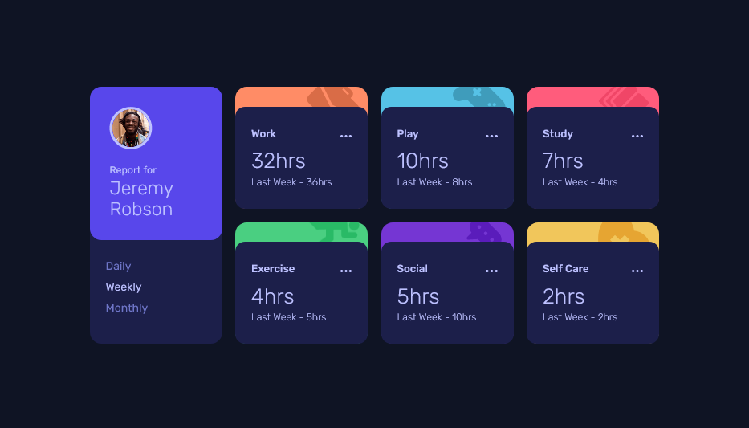

# Frontend Mentor - Time tracking dashboard solution
👋 Hi I am Rahul from India and this is my solution to the [Time tracking dashboard challenge on Frontend Mentor](https://www.frontendmentor.io/challenges/time-tracking-dashboard-UIQ7167Jw). Frontend Mentor challenges help you improve your coding skills by building realistic projects. 

## Table of contents

- [Overview](#overview)
  - [Screenshot](#screenshot)
  - [Links](#links)
- [My process](#my-process)
  - [Built with](#built-with)
  - [What I learned](#what-i-learned)
  - [Continued development](#continued-development)
  - [Useful resources](#useful-resources)
- [Author](#author)

## Overview

### Screenshot

### Links

- Solution URL: [Solution Link](https://github.com/Rahulbaran/time-dashboard.git)
- Live Site URL: [Site Link](https://mytimetracker.netlify.app/)

## My process

### Built with

- Semantic HTML5 markup
- CSS custom properties
- SCSS
- Flexbox
- CSS Grid
- Mobile-first workflow
- Vanilla JavaScript

### What I learned

While going through the project,
  * I used `XMLHttpRequest` API to fetch json from `data.json`
  * Practiced the CSS Grid layout.

### Continued development

In the future projects, I will be using more CSS Grid. Also my focus will be on third party APIs based projects.

### Useful Resources

If you ask me about useful resources for web development then first one which I will always recommend is [mdn docs](https://developer.mozilla.org/).

## Author

- Frontend Mentor - [@Rahulbaran](https://www.frontendmentor.io/profile/Rahulbaran)
- Twitter - [@Rahul9422dev](https://twitter.com/Rahul9422dev)
- Github - [@Rahulbaran](https://github.com/Rahulbaran/)
- Codepen - [@Rahulbaran](https://codepen.io/rahulbaran)

